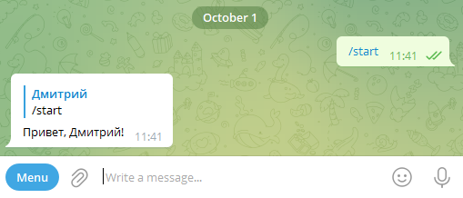
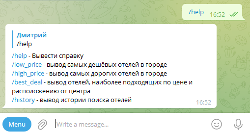
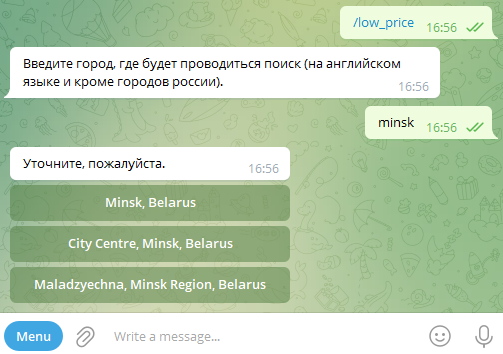
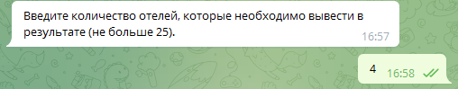
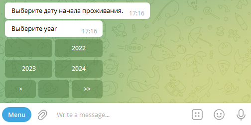
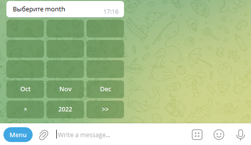
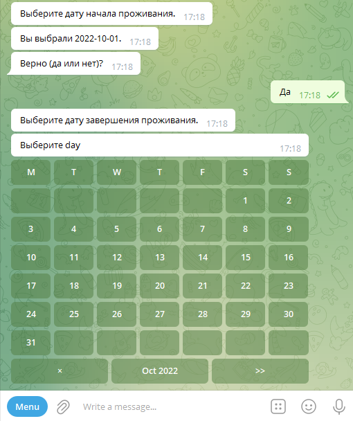
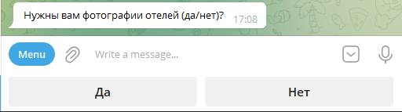
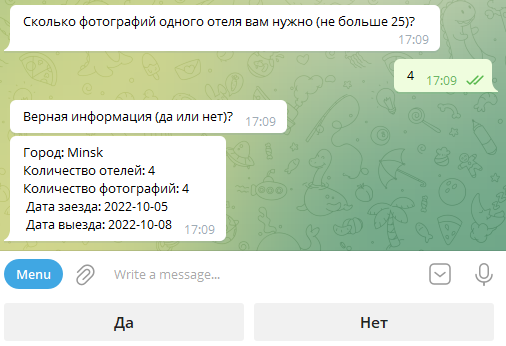
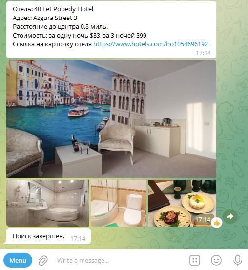

Инструкция по эксплуатации телеграмм-бота.

Перечень файлов проекта и краткое описание.

Файлы в корне проекта:

1) .env - описание данных
2) .env - необходимо создать вручную и поместить Токен телеграм-бота и API-ключ (rapidapi.com)
3) .gitignore - содержит папки и файлы, которые следует игнорировать при загрузке в GitLab
4) loader.py - создаёт экземпляр телеграмм-бота
5) log.py - задаёт конфигурацию для логирования
6) main.py - запускает бота и создаёт базу данных, в случае её отсутствия
7) Readme.md - инструкция по эксплуатации телеграмм-бота
8) Hotels.db - база данных sqlite. В случае отсутствия в проекте, запустите телеграм-бота
9) requirements.txt - модули, которые необходимо загрузить после создания окружения для работы телеграмм-бота

Пакеты в корне проекта:

1. config_data:
* init.py - инициализирует пакет settings и его содержимое
* config.py - подгружает переменные окружения, для работы бота и хранит параметры для запроса к API rapidapi.com

2. database:
* init.py - инициализирует пакет settings и его содержимое
* database.py - создает базу данных, описывает поля БД. Содержит методы: добавления данных в базу и выбор данных по id пользователя

3. handlers:
* init.py - инициализирует пакет handlers и его содержимое

3.1 custom_heandlers:
* init.py - инициализирует пакет settings и его содержимое
* best_deal.py - логика работы команды best_deal
* high_price.py - логика работы команды high_price
* low price.py - логика работы команды low price
* history.py - логика работы команды history

4.1 default_heandlers:
* init.py - инициализирует пакет settings и его содержимое
* echo.py - летят текстовые сообщения без указанного состояния
* help.py - выводит в чат текст с кратким описанием команд
* start.py - здоровается с пользователем. Работает только в самом начале

5. keyboards:
* init.py - инициализирует пакет settings и его содержимое

5.1 inline:
* init.py - инициализирует пакет settings и его содержимое
* choose_group.py - содержит все inline-клавиатуры участвующие в проекте (исключение: calendar)

5.2 reply:
* init.py - инициализирует пакет settings и его содержимое
* choose_answer.py - содержит все reply-клавиатуры участвующие в проекте

6. states:
* init.py - инициализирует пакет settings и его содержимое
* information_command_bestdeal.py - содержит все состояния пользователя, участвующие в команде best_deal
* information_command_highprice.py - содержит все состояния пользователя, участвующие в команде high_price
* information_command_lowprice.py - содержит все состояния пользователя, участвующие в команде low_price

7. utils:
* init.py - инициализирует пакет settings и его содержимое
* print_text.py - печатает конечный результат, выполнения команды, и введенные данные пользователем
* set_bot_commands.py - устанавливает команды телеграмм-бота
* sort.py - производит сортировку по удаленности отеля от центра
* surf_internet.py - содержит все эндпоинты делающие запросы к API

Инструкция по эксплуатации:

Для запуска бота, Вам необходимо будет создать виртуальное окружение. 
Поместить токен-бота и API-ключ rapidapi.com в переменные окружения (Файл .env). 
Далее запускаем бота в файле main.py. Для отслеживания функционирования бота и возможных ошибок, ведётся логгирование, путём записи данных в файлы. 
debug.log - записывает только возникшие исключения. 
Параметры логгирования можно изменить в файле log.py.

Команды бота:
* /start - Запуск бота
* /help — помощь по командам бота,
* /low_price — вывод самых дешёвых отелей в городе,
* /high_price — вывод самых дорогих отелей в городе,
* /best_deal — вывод отелей, наиболее подходящих по цене и расположению от центра.
* /history — вывод истории поиска отелей

Работа бота (для примера взята команда lowprice):

Старт бота

Команда help

Выбираем команду low_price, прописываем город поиска

Выбираем количество отелей

Выбираем дату заезда и выезда из отеля

Далее выбираем вывод отелей с фото, или без

В случае положительного ответа, выбираем количество фотографий к отелю и проверяем введенную информацию

Получаем результат

